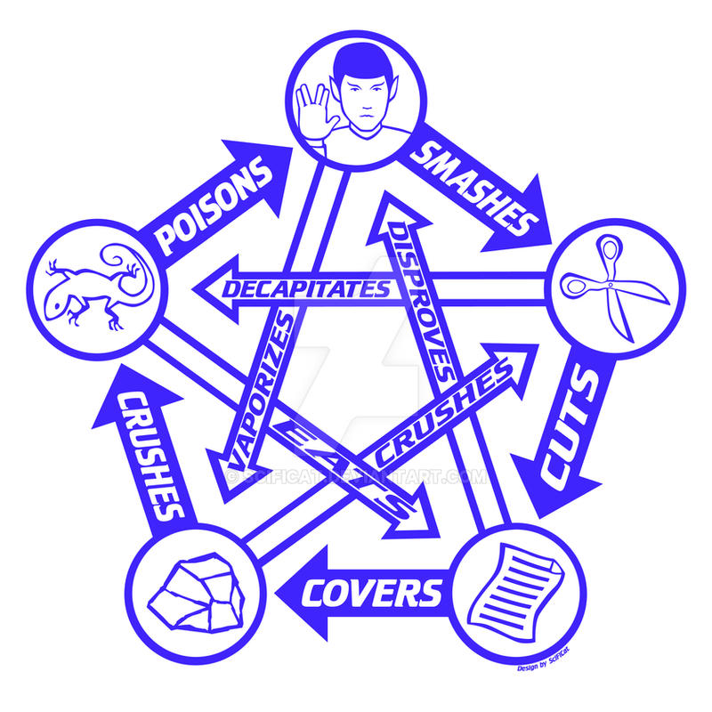
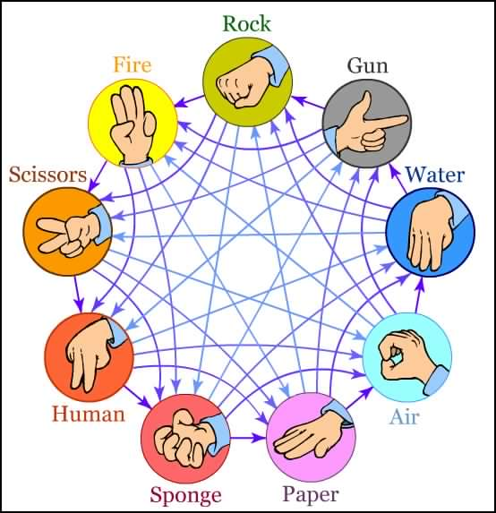
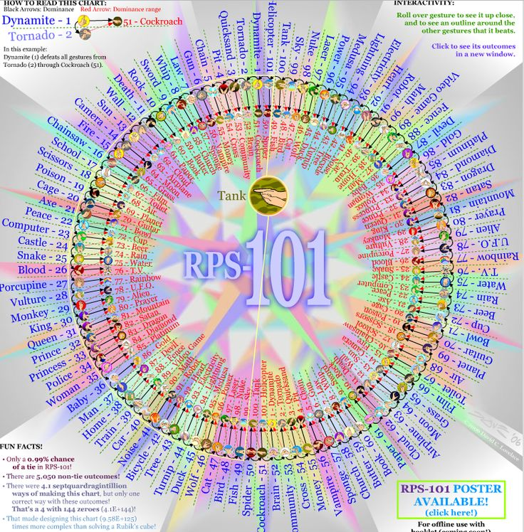

# Rock-Paper-Scissors Game Circuit

## Project Overview

[...]

### Game Rules

- Players: Two
- Moves: Rock, Paper, Scissors
- Winning Rules:

    

  - Rock beats Scissors
  - Scissors beat Paper
  - Paper beats Rock

- Tie: If both players choose the same move, the round ends in a tie.
- Minimum of 4 rounds must be played.
- Maximum of 19 rounds. The maximum is set by the initial clock cycle of the game.
- The winner is the first player to win 2 more rounds than their opponent, having played at least 4 rounds.
- In each round, the winner of the previous round cannot repeat their last move. If they do, the round is invalid and must be replayed.

### Circuit Specifications

#### Inputs:

1. **PRIMO \[2 bits\]**: Move selected by the first player.
   - 00: No move
   - 01: Rock
   - 10: Paper
   - 11: Scissors

2. **SECONDO \[2 bits\]**: Move selected by the second player.

3. **INIZIA \[1 bit\]**: When set to 1, resets the system to the initial configuration. The concatenation of PRIMO and SECONDO inputs specifies the maximum number of rounds beyond the required four.

#### Outputs:

1. **MANCHE \[2 bits\]**: Result of the last played round.
   - 00: Invalid round
   - 01: Round won by Player 1
   - 10: Round won by Player 2
   - 11: Round tied

2. **PARTITA \[2 bits\]**: Result of the entire game.
   - 00: Game ongoing
   - 01: Game over, Player 1 wins
   - 10: Game over, Player 2 wins
   - 11: Game over, Tie

### Implementation Details

The circuit in implemented in Verilog (behavioral style) and SIS. Both Verilog and SIS implementations have inputs and outputs in the same order as mentioned above.

#### Project Structure:

1. **MorraCinese.sv:** Main module for the circuit.
2. **testbench.sv:** Testbench for generating a script compatible with SIS.
3. **output_verilog.txt:** Output file from Verilog, detailing the results of each clock cycle.

#### SIS Files:

1. **FSMD.blif:** Main file for launching the simulation in SIS (pre-mapping).
2. **testbench.script:** Script generated by the Verilog testbench for SIS compatibility.
3. **non_ottimizzato/**: Sub-folder containing pre-optimization source files.

### Deliverables

1. **Verilog Source Files:**
   - design.sv
   - testbench.sv
   - output_verilog.txt

2. **SIS Source Files:**
   - FSMD.blif
   - testbench.script
   - non_ottimizzato/ (sub-folder)

3. **Report:**
   - Relazione.pdf
     - A4 format
     - Include student IDs, names, and surnames
     - Cover the specified points:
       - General circuit architecture (FSMD schema)
       - Controller state diagram
       - Datapath architecture
       - Circuit statistics pre and post optimization for area
       - Number of gates and delay obtained by mapping onto synch.genlib library
       - Explanation of design choices

##### TODO:
alternative versions (TBA):

