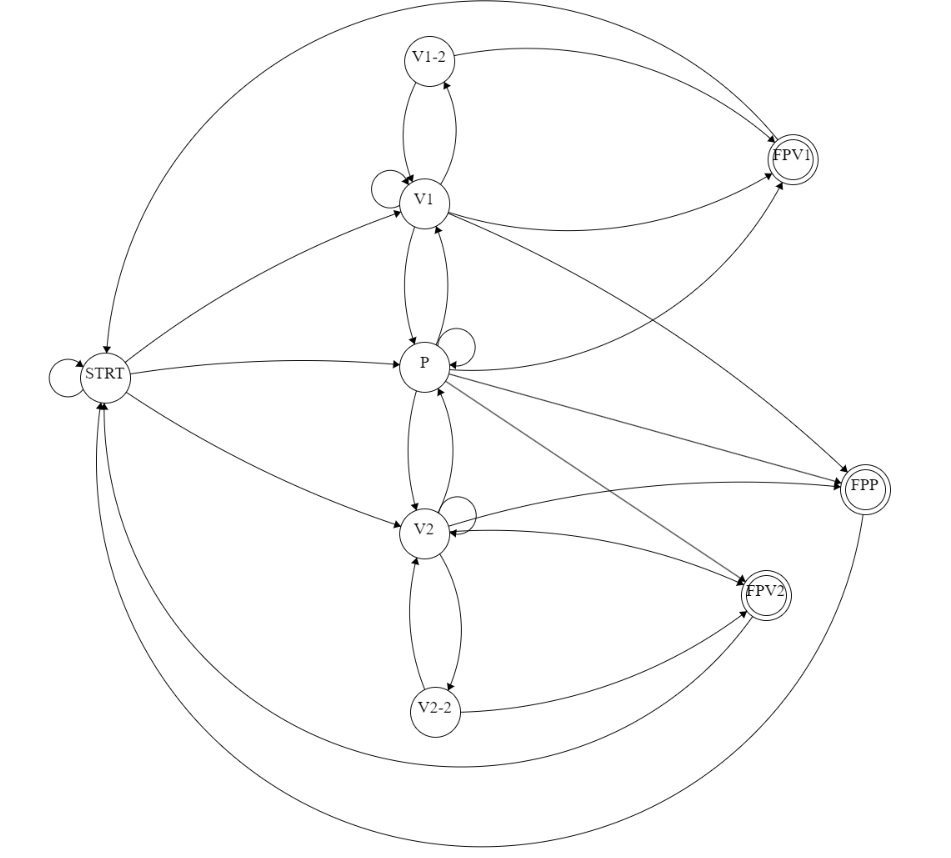

00: nessuna mossa

01: Sasso

10: Carta

11: Forbice

OutputWM: who won the match:
- 00:even
- 01:P1
- 10:P2
  
OutputWG: who is winning the game: same as above

max: whether or not the number of matches is ok (>4)
4<=19

okmin4

| Play | okmin4 | max | MoveP1 | MoveP2 | OutputWM | OutputWG | reset | EndGame | State | Target | comment                           |
| ---- | ------ | --- | ------ | ------ | -------- | -------- | ----- | ------- | ----- | ------ | --------------------------------- |
| 0    | -      | -   | -      | -      | -        | -        | 1     | 0 | STRT  | STRT   |                                   |
| 0    | -      | -   | -      | -      | -        | -        | 1     | 0 | V1    | STRT   | reset                             |
| 0    | -      | -   | -      | -      | -        | -        | 1     | 0 | V2    | STRT   | reset                             |
| 0    | -      | -   | -      | -      | -        | -        | 1     | 0 | P     | STRT   | reset                             |
| 0    | -      | -   | -      | -      | -        | -        | 1     | 0 | V1-2  | STRT   | reset                             |
| 0    | -      | -   | -      | -      | -        | -        | 1     | 0 | V2-2  | STRT   | reset                             |
| 1    | -      | -   | 01     | 11     | 01       | 01       | 0     | 0 | STRT  | V1     | sasso-forbice                     |
| 1    | -      | -   | 10     | 01     | 01       | 01       | 0     | 0 | STRT  | V1     | carta-sasso                       |
| 1    | -      | -   | 11     | 10     | 01       | 01       | 0     | 0 | STRT  | V1     | forbice-carta                     |
| 1    | -      | -   | 11     | 01     | 10       | 10       | 0     | 0 | STRT  | V2     | forbice-sasso                     |
| 1    | -      | -   | 01     | 10     | 10       | 10       | 0     | 0 | STRT  | V2     | sasso-carta                       |
| 1    | -      | -   | 10     | 11     | 10       | 10       | 0     | 0 | STRT  | V2     | carta-forbice                     |
| 1    | -      | -   | 01     | 01     | 00       | 00       | 0     | 0 | STRT  | P      | sasso-sasso                       |
| 1    | -      | -   | 10     | 10     | 00       | 00       | 0     | 0 | STRT  | P      | carta-carta                       |
| 1    | -      | -   | 11     | 11     | 00       | 00       | 0     | 0 | STRT  | P      | forbice-forbice                   |
| 1    | -      | 0   | 01     | 01     | 00       | 00       | 0     | 0 | P     | P      | sasso-sasso                       |
| 1    | -      | 0   | 10     | 10     | 00       | 00       | 0     | 0 | P     | P      | carta-carta                       |
| 1    | -      | 0   | 11     | 11     | 00       | 00       | 0     | 0 | P     | P      | forbice-forbice                   |
| 1    | -      | 0   | 01     | 11     | 01       | 01       | 0     | 0 | P     | V1     | sasso-forbice                     |
| 1    | -      | 0   | 10     | 01     | 01       | 01       | 0     | 0 | P     | V1     | carta-sasso                       |
| 1    | -      | 0   | 11     | 10     | 01       | 01       | 0     | 0 | P     | V1     | forbice-carta                     |
| 1    | -      | 0   | 11     | 01     | 10       | 10       | 0     | 0 | P     | V2     | forbice-sasso                     |
| 1    | -      | 0   | 01     | 10     | 10       | 10       | 0     | 0 | P     | V2     | sasso-carta                       |
| 1    | -      | 0   | 10     | 11     | 10       | 10       | 0     | 0 | P     | V2     | carta-forbice                     |
| 1    | 0      | 0   | 01     | 11     | 01       | 01       | 0     | 0 | V1    | V1-2   | sasso-forbice 1wins2time          |
| 1    | 0      | 0   | 10     | 01     | 01       | 01       | 0     | 0 | V1    | V1-2   | carta-sasso   1wins2time          |
| 1    | 0      | 0   | 11     | 10     | 01       | 01       | 0     | 0 | V1    | V1-2   | forbice-carta 1wins2time          |
| 1    | -      | 0   | 11     | 01     | 10       | 00       | 0     | 0 | V1    | P      | forbice-sasso  gotoeven           |
| 1    | -      | 0   | 01     | 10     | 10       | 00       | 0     | 0 | V1    | P      | sasso-carta    gotoeven           |
| 1    | -      | 0   | 10     | 11     | 10       | 00       | 0     | 0 | V1    | P      | carta-forbice  gotoeven           |
| 1    | 0      | 0   | 11     | 01     | 10       | 10       | 0     | 0 | V2    | V2-2   | forbice-sasso  2wins2time         |
| 1    | 0      | 0   | 01     | 10     | 10       | 10       | 0     | 0 | V2    | V2-2   | sasso-carta    2wins2time         |
| 1    | 0      | 0   | 10     | 11     | 10       | 10       | 0     | 0 | V2    | V2-2   | carta-forbice  2wins2time         |
| 1    | -      | 0   | 01     | 11     | 01       | 00       | 0     | 0 | V2    | P      | sasso-forbice gotoeven            |
| 1    | -      | 0   | 10     | 01     | 01       | 00       | 0     | 0 | V2    | P      | carta-sasso   gotoeven            |
| 1    | -      | 0   | 11     | 10     | 01       | 00       | 0     | 0 | V2    | P      | forbice-carta gotoeven            |
| 1    | -      | 0   | 11     | 11     | 00       | 01       | 0     | 0 | V1    | V1     | forbice-forbice evenrmainv1       |
| 1    | -      | 0   | 01     | 01     | 00       | 01       | 0     | 0 | V1    | V1     | sasso-sasso     evenrmainv1       |
| 1    | -      | 0   | 10     | 10     | 00       | 01       | 0     | 0 | V1    | V1     | carta-carta     evenrmainv1       |
| 1    | -      | 0   | 11     | 11     | 00       | 10       | 0     | 0 | V2    | V2     | forbice-forbice evenrmainv2       |
| 1    | -      | 0   | 01     | 01     | 00       | 10       | 0     | 0 | V2    | V2     | sasso-sasso     evenrmainv2       |
| 1    | -      | 0   | 10     | 10     | 00       | 10       | 0     | 0 | V2    | V2     | carta-carta     evenrmainv2       |
| 1    | 1      | 1   | 01     | 01     | 00       | 00       | 0     | 1 | P     | STRT   | sasso-sasso     fromeventowineven |
| 1    | 1      | 1   | 10     | 10     | 00       | 00       | 0     | 1 | P     | STRT   | carta-carta     fromeventowineven |
| 1    | 1      | 1   | 11     | 11     | 00       | 00       | 0     | 1 | P     | STRT   | forbice-forbice fromeventowineven |
| 1    | 1      | 1   | 01     | 11     | 01       | 01       | 0     | 1 | P     | STRT   | sasso-forbice fromeventowin1      |
| 1    | 1      | 1   | 10     | 01     | 01       | 01       | 0     | 1 | P     | STRT   | carta-sasso   fromeventowin1      |
| 1    | 1      | 1   | 11     | 10     | 01       | 01       | 0     | 1 | P     | STRT   | forbice-carta fromeventowin1      |
| 1    | 1      | 1   | 11     | 01     | 10       | 10       | 0     | 1 | P     | STRT   | forbice-sasso fromeventowin2      |
| 1    | 1      | 1   | 01     | 10     | 10       | 10       | 0     | 1 | P     | STRT   | sasso-carta   fromeventowin2      |
| 1    | 1      | 1   | 10     | 11     | 10       | 10       | 0     | 1 | P     | STRT   | carta-forbice fromeventowin2      |
| 1    | 1      | -   | 01     | 11     | 01       | 01       | 0     | 1 | V1    | STRT   | sasso-forbice winp1               |
| 1    | 1      | -   | 10     | 01     | 01       | 01       | 0     | 1 | V1    | STRT   | carta-sasso   winp1               |
| 1    | 1      | -   | 11     | 10     | 01       | 01       | 0     | 1 | V1    | STRT   | forbice-carta winp1               |
| 1    | 1      | 1   | 11     | 01     | 10       | 00       | 0     | 1 | V1    | STRT   | forbice-sasso  wineven            |
| 1    | 1      | 1   | 01     | 10     | 10       | 00       | 0     | 1 | V1    | STRT   | sasso-carta    wineven            |
| 1    | 1      | 1   | 10     | 11     | 10       | 00       | 0     | 1 | V1    | STRT   | carta-forbice  wineven            |
| 1    | 1      | -   | 11     | 01     | 10       | 10       | 0     | 1 | V2    | STRT   | forbice-sasso  winp2              |
| 1    | 1      | -   | 01     | 10     | 10       | 10       | 0     | 1 | V2    | STRT   | sasso-carta    winp2              |
| 1    | 1      | -   | 10     | 11     | 10       | 10       | 0     | 1 | V2    | STRT   | carta-forbice  winp2              |
| 1    | 1      | 1   | 01     | 11     | 01       | 00       | 0     | 1 | V2    | STRT   | sasso-forbice gotoeven            |
| 1    | 1      | 1   | 10     | 01     | 01       | 00       | 0     | 1 | V2    | STRT   | carta-sasso   gotoeven            |
| 1    | 1      | 1   | 11     | 10     | 01       | 00       | 0     | 1 | V2    | STRT   | forbice-carta gotoeven            |
| 1    | -      | -   | 11     | 11     | 00       | 01       | 0     | 1 | V1-2  | STRT   | forbice-forbice winp1             |
| 1    | -      | -   | 01     | 01     | 00       | 01       | 0     | 1 | V1-2  | STRT   | sasso-sasso     winp1             |
| 1    | -      | -   | 10     | 10     | 00       | 01       | 0     | 1 | V1-2  | STRT   | carta-carta     winp1             |
| 1    | -      | -   | 11     | 11     | 00       | 10       | 0     | 1 | V2-2  | STRT   | forbice-forbice winp2             |
| 1    | -      | -   | 01     | 01     | 00       | 10       | 0     | 1 | V2-2  | STRT   | sasso-sasso     winp2             |
| 1    | -      | -   | 10     | 10     | 00       | 10       | 0     | 1 | V2-2  | STRT   | carta-carta     winp2             |
| 1    | -      | -   | 11     | 01     | 10       | 10       | 0     | 1 | V2_2  | STRT   | forbice-sasso  winp2              |
| 1    | -      | -   | 01     | 10     | 10       | 10       | 0     | 1 | V2_2  | STRT   | sasso-carta    winp2              |
| 1    | -      | -   | 10     | 11     | 10       | 10       | 0     | 1 | V2_2  | STRT   | carta-forbice  winp2              |
| 1    | -      | -   | 01     | 11     | 01       | 01       | 0     | 1 | V1_2  | STRT   | sasso-forbice winp1               |
| 1    | -      | -   | 10     | 01     | 01       | 01       | 0     | 1 | V1_2  | STRT   | carta-sasso   winp1               |
| 1    | -      | -   | 11     | 10     | 01       | 01       | 0     | 1 | V1_2  | STRT   | forbice-carta winp1               |