# Report
### Secchi Pietro Giampaolo, Simone Vincenzo di Maria


## 1 Descrizione del Progetto
In questo elaborato viene descritto il progetto di un dispositivo per la gestione di partite di Morra Cinese, noto anche come sasso-carta-forbici. Il dispositivo è implementato in Verilog e SIS, due linguaggi di descrizione hardware.
Il circuito riceverà in input le mosse di due player e verranno giocate da un minimo di 4 ad un massimo di 19 manche, il primo giocatore che abbia raggiunto 2 punti di vantaggio sull'altro vince.

## 2 Controllore 
Il controllore, il cui diagramma di transizione degli stati viene riportato qui di seguito, è
progettato mediante il modello **Finite State Machine**:

### 2.1  State Transitions Graph
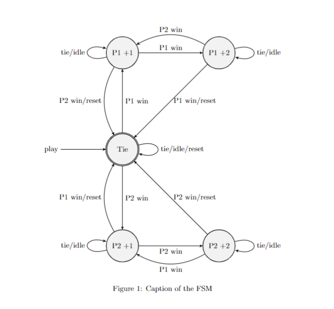

### 2.2 Inputs
Input relativi al controllore:
- Valid[i]: 
  - Quando vale 1 il controllore eseguirà una partita.
  - Quando vale 0 il controllore rimane in uno stato di idle
- Min[1]:
  - Quando vale 1 significa che il minimo numero di partite è stato giocato, quindi se lo stato in cui la FSM si trova è P1_W1 o P2_W1 e suddetto giocatore vince, la FSM lo dichiarerà vincitore.
  - Quando vale 0 il minimo numero di partite non è stato raggiunto, quindi se la FSM si trova è P1_W1 o P2_W1 e suddetto giocatore vince, la FSM avrà come nuovo stato P1_W2 o P2_W2.
- Max[1]
  - Quando vale 1 significa che il massimo numero di partite verrà giocato con questa partita, quindi se, dopo aver calcolato questa manche il giocatore in vantaggio verrà dichiarato vincitore. La FSM tornerà allo stato iniziale
  - Quando vale 0 il massimo numero di partite non è stato raggiunto.
- Player1Move[2]:
  - Mossa del giocatore 1
- Player2Move[2]:
  - Mossa del giocatore 2

Le mosse possibili sono:
- 00:nessuna mossa
- 01:sasso
- 10:carta
- 11:forbice

### 2.3 Outputs
Outputs relativi al controllore:
- GameWinner[2]: Il giocatore che ha vinto l'intera partita
- MancheWinner[2]: Il giocatore che ha vinto la manche

### 2.4 Architettura del controllore

Il controllore è stato progettato utilizzando i seguenti stati:
-  Tie(Reset):Stato in cui si trova quando lo stato della partita è pareggio oppure quando è in uno stato di reset
-  P1_W1: Stato in cui si trova quando giocatore 1 è in vantaggio di un punto
-  P1_W2: Stato in cui si trova quando giocatore 1 è in vantaggio di due punti
-  P2_W1: Stato in cui si trova quando giocatore 2 è in vantaggio di un punto
-  P2_W2: Stato in cui si trova quando giocatore 1 è in vantaggio due un punti


**Stato iniziale e validazione mosse:**

- Quando il controllore viene attivato, si trova nello stato **Tie** (pareggio).
- Se **Valid** è 1 e le mosse dei giocatori sono valide, la FSM determina il vincitore della manche.
- Se le mosse non sono valide, **Valid** viene settato a 0 nel datapath e la FSM rimane in idle nello stesso stato.

**Gestione vantaggio:**

- Se un giocatore in vantaggio di un punto vince ancora e il minimo di partite è stato raggiunto, la FSM determina il vincitore totale.
- Se il minimo non è stato raggiunto, il giocatore aumenta il suo vantaggio a due punti nello stato **Px_W2**.
- Lo stato **Px_W2** serve solo per gestire le prime partite in cui un giocatore vince due volte consecutive, dando all'avversario la possibilità di rimontare senza terminare la partita prematuramente.
- Se un giocatore è in vantaggio di due punti e vince ancora, la macchina a stati lo dichiara automaticamente vincitore della partita tornando allo stato iniziale, gestisco nel datapath la quarta partita obbligatoria, mettendo in output il vincitore solo se sono state giocate 4 partite.

- Quando il massimo di mosse è stato raggiunto (**Max** = 1 nella manche iesima), la FSM esegue la manche e determina il vincitore in base al punteggio in quel momento.
Ad esempio, se la FSM si trova in **P1_1** e vince il giocatore 2, la FSM passa a **Tie** e dichiara un pareggio.


### Scelte Progettuali
Abbiamo deciso di utilizzare 5 stati, in quanto è il numero minimo di stati necessario per realizzare un circuito secondo le specifiche, riutilizzando lo stato **Tie** come stato iniziale, per risparmiare uno stato. Per completezza e facilità di lettura, avremmo potuto utilizzare più stati dividendo **Tie** e lo stato iniziale, e aggiungendo altri due stati per ottenere il vantaggio di tre punti.


## 3 Unità di Elaborazione
L'unità di elaborazione è realizzata tramite il modello datapath , ed è così schematizzata:

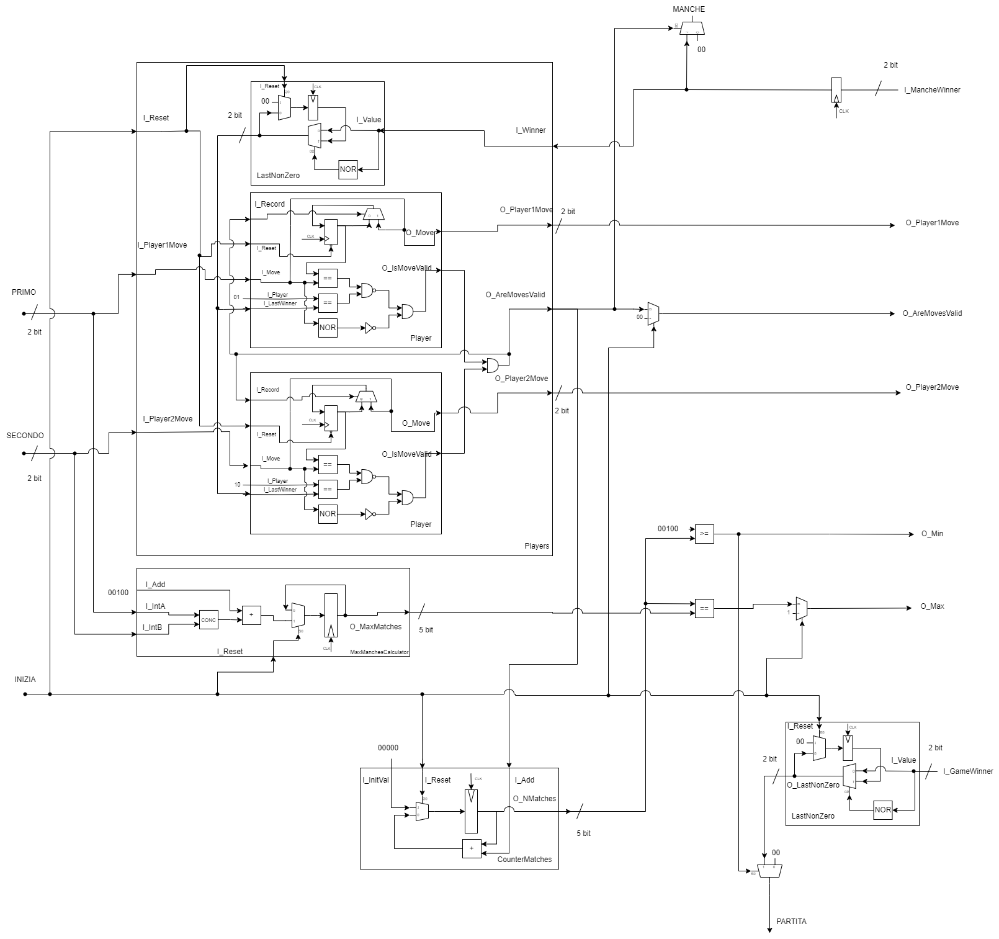

Abbiamo cinque sottomoduli principali:
- **Player**

si occupa di controllare la validità delle mosse, prende in input l'ultimo vincitore, il nome del giocatore che rappresenta (01,10), la mossa e un bit per decidere se registrare la mossa.
Utilizza un registro D con reset per resettare lo stato dell'ultima mossa in memoria.
Per capire se la mossa è valida usa questa tabella di verità:

| EqualLastMove | EqualLastWinner | Invalid | ¬(EqualLastMove ∧ EqualLastWinner) ∧ ¬Invalid |
| ------------- | --------------- | ------- | --------------------------------------------- |
| F             | F               | F       | T                                           |
| F             | F               | T       | F                                           |
| F             | T               | F       | T                                           |
| F             | T               | T       | F                                           |
| T             | F               | F       | T                                           |
| T             | F               | T       | F                                           |
| T             | T               | F       | F                                           |
| T             | T               | T       | F                                           |

- **LastNonZero**
  
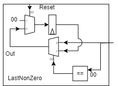

Questo modulo prende in input due bit e in output mette l'ultima coppia di bit dove entrambi non erano 0, questo viene usato in **Players** per dare ai singoli player l'ultimo vincitore valido e viene usato anche per mantenere in memoria lo stato del vincitore della partita.
Ha un bit di reset per pulire i registri.


- **Players**


Incorpora 2 moduli **Player** e un modulo **LastNonZero**, esegue un operazione di and con gli output dei **Player** e il risultato viene messo in input ai **Player** per registrare la mossa se valida (1) utilizzando un multiplexer

- **MaxManchesCalculator**


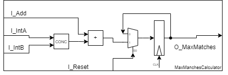

Entra in funzione quando INIZIA è a 1 ed esegue una concatenazione di **PRIMO** e **SECONDO**, aggiungendoci **I_Add**, che in questo caso è 4(00100) per avere in output il numero massimo di manche, viene resettato con I_Reset

- **Counter**

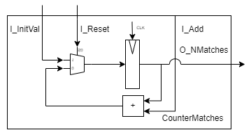

Conta il numero di manche giocate. Ha come input I_Add che in questo caso è **O_AreMovesValid** di players, quindi se le mosse sono valide il counter viene incrementato.


## 3.2 Inputs
Inputs relativi all'elaboratore
- PRIMO[2]:Se **INIZA**==0 è la mossa del giocatore, altrimenti viene usato per sapere la quantità di manche da giocare
- SECONDO[2]:Se **INIZA**==0 è la mossa del giocatore, altrimenti viene usato per sapere la quantità di manche da giocare
- INIZIA[1] Se INIZA è uguale a 0, il circuito gioca; altrimenti, viene utilizzato per determinare la quantità di manche da giocare.
- GameWinner[2]: preso dall'output della FSM
- MancheWinner[2]: preso dall'output della FSM

## 3.3 Outputs
Outputs relativi all'elaboratore:
- O_Player1Move[2]:
- O_Player2Move[2]:
- O_AreMovesValid[1]:
- O_Min[1]:
- O_Max[1]:
### Scelte progettuali
Per risparmiare logica i controlli per confrontare un valore a 00 vengono fatti con un NOR.
**I_Add** del counter di partite è direttamente   **O_AreMovesValid** da **Players**.
Le mosse dei giocatori prese in input in **Players** vengono passate direttamente ai **Player**, che le metteranno in output sempre, anche quando non sono valide. Si sarebbe potuto far passare il segnale delle mosse senza farlo passare per i suddetti moduli; abbiamo deciso però di farlo per rendere il datapath più pulito.
Il numero di manche viene registrato con registri a 5 bit poichè può essere da 0 a 19 e quindi log_2(19)=4.24792751 che, approssimato per eccesso è 5, quindi abbiamo bisogno di almeno 5 registri. Un altra opzione sarebbe stata quella di usarne 8 per rimanere con un numero più comune, essendo potenza di 2.


# 4 Realizzazione del circuito in blif
Per poter realizzare il circuito abbiamo prima di tutto assegnato alla FSM descritta sotto forma di STG gli stati mediante la funzione state_assign jedi, che si è occupata anche di mappare la FSM come circuito sequenziale. A questo punto, valutato il corretto funzionamento rispettivamente di FSM e DATAPATH, abbiamo unito elaboratore e controllore mediante un unico file FSMD.blif.

### Nota
Nel caricare il file del circuito, vengono prodotti alcuni warning che indicano il mancato output del COUT di qualche modulo. Poiché questi bit non sono interessanti, abbiamo optato per aggirare SIS creando un modulo che in realtà non fa nulla, così da evitare di avere dei warning ogni volta che si carica il file blif.


# 4.1  Ottimizzazione e mapping del circuito
Siamo passati quindi all'ottimizzazione per area totale, utilizzando tutti gli script che sono disponibili all'interno della cartella di sis e questi sono i risultati per ogni comando nello script:

- **algebraic.script**:
```
pi= 5	po= 4	nodes=146	latches=23 lits(sop)= 819

pi= 5	po= 4	nodes= 80	latches=23 lits(sop)= 617
pi= 5	po= 4	nodes= 35	latches=23 lits(sop)=1000
pi= 5	po= 4	nodes= 35	latches=23 lits(sop)= 923
pi= 5	po= 4	nodes= 35	latches=23 lits(sop)= 912
pi= 5	po= 4	nodes= 39	latches=23 lits(sop)= 521
pi= 5	po= 4	nodes= 39	latches=23 lits(sop)= 521
pi= 5	po= 4	nodes= 39	latches=23 lits(sop)= 521
pi= 5	po= 4	nodes= 39	latches=23 lits(sop)= 521
pi= 5	po= 4	nodes= 43	latches=23 lits(sop)= 452
pi= 5	po= 4	nodes= 43	latches=23 lits(sop)= 452
pi= 5	po= 4	nodes= 44	latches=23 lits(sop)= 441
pi= 5	po= 4	nodes= 44	latches=23 lits(sop)= 441
pi= 5	po= 4	nodes= 76	latches=23 lits(sop)= 358
pi= 5	po= 4	nodes= 76	latches=23 lits(sop)= 354
pi= 5	po= 4	nodes= 84	latches=23 lits(sop)= 340
pi= 5	po= 4	nodes= 84	latches=23 lits(sop)= 340
pi= 5	po= 4	nodes= 60	latches=23 lits(sop)= 422

pi= 5	po= 4	nodes= 91	latches=23 lits(sop)= 342

```
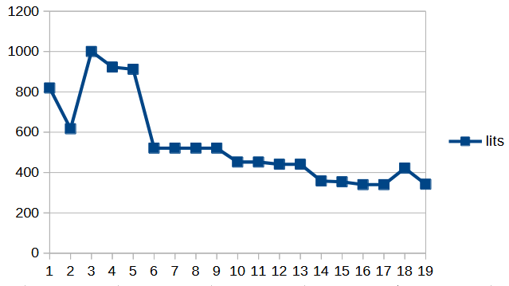


- **boolean.script**:
```
pi= 5	po= 4	nodes=146	latches=23 lits(sop)= 819

pi= 5	po= 4	nodes= 45	latches=23 lits(sop)= 949
pi= 5	po= 4	nodes= 45	latches=23 lits(sop)= 845
pi= 5	po= 4	nodes= 43	latches=23 lits(sop)=1055
pi= 5	po= 4	nodes= 35	latches=23 lits(sop)=1091
pi= 5	po= 4	nodes= 35	latches=23 lits(sop)= 913
pi= 5	po= 4	nodes= 35	latches=23 lits(sop)= 909
pi= 5	po= 4	nodes= 39	latches=23 lits(sop)= 545
pi= 5	po= 4	nodes= 39	latches=23 lits(sop)= 545
pi= 5	po= 4	nodes= 39	latches=23 lits(sop)= 545
pi= 5	po= 4	nodes= 39	latches=23 lits(sop)= 545
pi= 5	po= 4	nodes= 43	latches=23 lits(sop)= 446
pi= 5	po= 4	nodes= 43	latches=23 lits(sop)= 446
pi= 5	po= 4	nodes= 43	latches=23 lits(sop)= 446
pi= 5	po= 4	nodes= 43	latches=23 lits(sop)= 446
pi= 5	po= 4	nodes= 67	latches=23 lits(sop)= 373
pi= 5	po= 4	nodes= 67	latches=23 lits(sop)= 372
pi= 5	po= 4	nodes= 74	latches=23 lits(sop)= 363
pi= 5	po= 4	nodes= 74	latches=23 lits(sop)= 363
pi= 5	po= 4	nodes= 53	latches=23 lits(sop)= 455
pi= 5	po= 4	nodes= 92	latches=23 lits(sop)= 364

pi= 5	po= 4	nodes= 57	latches=23 lits(sop)= 419

```


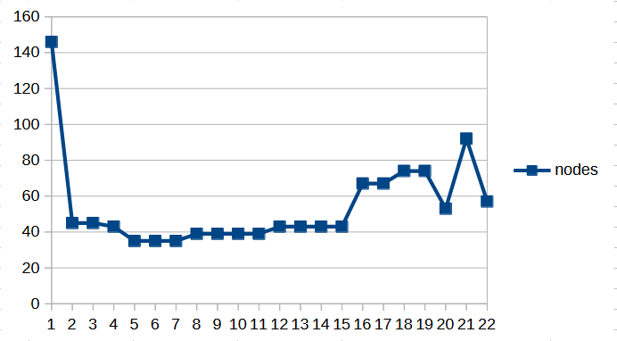


- **delay.script**:
```
pi= 5	po= 4	nodes=146	latches=23 lits(sop)= 819
pi= 5	po= 4	nodes= 80	latches=23 lits(sop)= 617
pi= 5	po= 4	nodes=115	latches=23 lits(sop)= 467
pi= 5	po= 4	nodes=367	latches=23 lits(sop)= 716
pi= 5	po= 4	nodes=367	latches=23 lits(sop)= 634
pi= 5	po= 4	nodes=285	latches=23 lits(sop)= 552
pi= 5	po= 4	nodes= 57	latches=23 lits(sop)=2355

```
al comando red_removal, che genera input causali per semplificare il blif si blocca, dopo 10 minuti ancora non c'è stato nessun risultato 


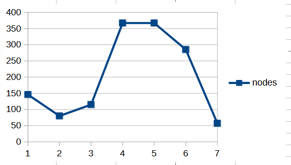
- **rugged.script**:
```
pi= 5	po= 4	nodes=146	latches=23 lits(sop)= 819

pi= 5	po= 4	nodes= 45	latches=23 lits(sop)= 949
pi= 5	po= 4	nodes= 45	latches=23 lits(sop)= 842
pi= 5	po= 4	nodes= 43	latches=23 lits(sop)=1052
pi= 5	po= 4	nodes= 35	latches=23 lits(sop)=1088
pi= 5	po= 4	nodes= 35	latches=23 lits(sop)= 901
pi= 5	po= 4	nodes= 35	latches=23 lits(sop)= 897
pi= 5	po= 4	nodes= 77	latches=23 lits(sop)= 367
pi= 5	po= 4	nodes= 77	latches=23 lits(sop)= 367
pi= 5	po= 4	nodes= 56	latches=23 lits(sop)= 450

pi= 5	po= 4	nodes= 56	latches=23 lits(sop)= 354

```
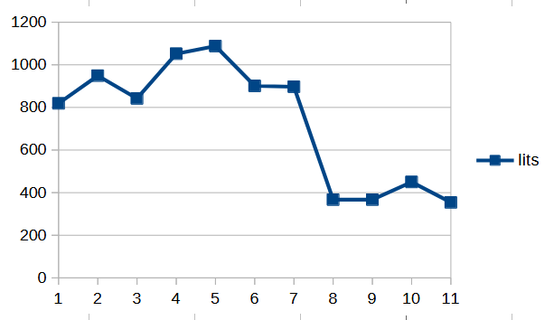


- **script**:
```
pi= 5	po= 4	nodes=146	latches=23 lits(sop)= 819

pi= 5	po= 4	nodes= 45	latches=23 lits(sop)= 949
pi= 5	po= 4	nodes= 45	latches=23 lits(sop)= 845
pi= 5	po= 4	nodes= 43	latches=23 lits(sop)=1055
pi= 5	po= 4	nodes= 35	latches=23 lits(sop)=1091
pi= 5	po= 4	nodes= 35	latches=23 lits(sop)= 913
pi= 5	po= 4	nodes= 35	latches=23 lits(sop)= 909
pi= 5	po= 4	nodes= 39	latches=23 lits(sop)= 545
pi= 5	po= 4	nodes= 39	latches=23 lits(sop)= 545
pi= 5	po= 4	nodes= 39	latches=23 lits(sop)= 545
pi= 5	po= 4	nodes= 39	latches=23 lits(sop)= 545
pi= 5	po= 4	nodes= 43	latches=23 lits(sop)= 446
pi= 5	po= 4	nodes= 43	latches=23 lits(sop)= 446
pi= 5	po= 4	nodes= 43	latches=23 lits(sop)= 446
pi= 5	po= 4	nodes= 43	latches=23 lits(sop)= 446
pi= 5	po= 4	nodes= 67	latches=23 lits(sop)= 373
pi= 5	po= 4	nodes= 67	latches=23 lits(sop)= 372
pi= 5	po= 4	nodes= 74	latches=23 lits(sop)= 363
pi= 5	po= 4	nodes= 74	latches=23 lits(sop)= 363
pi= 5	po= 4	nodes= 53	latches=23 lits(sop)= 455
pi= 5	po= 4	nodes= 92	latches=23 lits(sop)= 364

pi= 5	po= 4	nodes= 57	latches=23 lits(sop)= 419

```

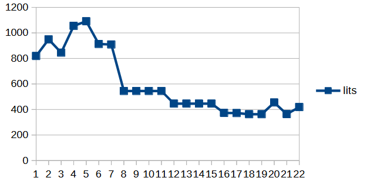
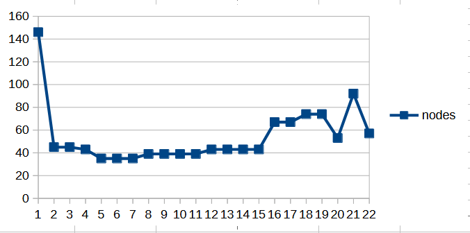


Possiamo notare che il numero di latch è rimasto uguale, questo significa che abbiamo utilizzato il minimo numero di latch necessari per il progetto.
Possiamo anche notare che script.rugged è stato il più performante nello semplificare i nodi, arrivando a 56 nodi, ma il secondo migliore nello semplificare i letterali con 354 letterali, contro i 342 di algebraic.script

# 4.3 Esecuzione del mapping
Abbiamo eseguito il mapping con la libreria tecnologica synch.genlib
```
UC Berkeley, SIS 1.3.6 (compiled 2017-10-27 16:08:57)
sis> rl FSMD.blif
sis> print_stats
FSMD            pi= 5   po= 4   nodes=146       latches=23
lits(sop)= 819
sis> source script.rugged
sis> print_stats
FSMD            pi= 5   po= 4   nodes= 56       latches=23
lits(sop)= 354
sis>  read_library synch.genlib
sis>  map -m 0 -s
warning: unknown latch type at node '{[6034]}' (RISING_EDGE assumed)
warning: unknown latch type at node '{[6035]}' (RISING_EDGE assumed)
warning: unknown latch type at node '{[6036]}' (RISING_EDGE assumed)
WARNING: uses as primary input drive the value (0.20,0.20)
WARNING: uses as primary input arrival the value (0.00,0.00)
WARNING: uses as primary input max load limit the value (999.00)
WARNING: uses as primary output required the value (0.00,0.00)
WARNING: uses as primary output load the value 1.00
>>> before removing serial inverters <<<
# of outputs:          27
total gate area:       6248.00
maximum arrival time: (39.20,39.20)
maximum po slack:     (-4.00,-4.00)
minimum po slack:     (-39.20,-39.20)
total neg slack:      (-509.40,-509.40)
# of failing outputs:  27
>>> before removing parallel inverters <<<
# of outputs:          27
total gate area:       6120.00
maximum arrival time: (39.20,39.20)
maximum po slack:     (-4.00,-4.00)
minimum po slack:     (-39.20,-39.20)
total neg slack:      (-504.60,-504.60)
# of failing outputs:  27
# of outputs:          27
total gate area:       6024.00
maximum arrival time: (39.20,39.20)
maximum po slack:     (-4.00,-4.00)
minimum po slack:     (-39.20,-39.20)
total neg slack:      (-503.60,-503.60)
# of failing outputs:  27
sis> print_stats
FSMD            pi= 5   po= 4   nodes=152       latches=23
lits(sop)= 385
sis>
```
da notare che siamo passati a 152 nodi e 385 letterali